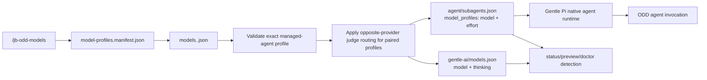

# Understand how model switching works

`/jb-odd-models` keeps a human-facing canonical profile and the Gentle Pi runtime mapping aligned for the managed ODD agents and any configured judge/reviewer agents. Profile names, managed agents, and opposite-provider judge routing are read from `gentle-ai/model-profiles.manifest.json`; named profile data lives in `gentle-ai/models.<profile>.json`.

## Shared scope and live session

Selection changes **shared persisted configuration**, not session-local routing. Sessions using the same target paths share `gentle-ai/models.json` and `agent/subagents.json`. Direct selection also aligns the invoking session's live orchestrator model and thinking, then reloads only that caller when files changed. It does not broadcast live model changes to other sessions.

Status separates these sources:

| Evidence | Meaning |
|---|---|
| `Persisted ODD profile` | Named/custom/unknown detection from both shared files, not the caller's live profile. |
| Canonical/runtime source paths and mappings | Saved `model`/`thinking` and persisted runtime `model`/`effort`; runtime here does not mean a live agent. |
| `Invoking live orchestrator` | Caller model from `ctx.model`, thinking from `pi.getThinkingLevel()`. |
| `Live vs canonical` / `live vs runtime` | Model-and-thinking comparison for the orchestrator only; `unknown` when evidence is unavailable. |

The compatibility label `Active ODD profile` is retained with an explicit shared-persisted qualifier; it describes the same saved mapping, not the live session.

A mismatch does not identify its cause or prove what children or reviewers actually execute. Other sessions are not observed, and refresh timing is not guaranteed. No session isolation or routing authority changes are introduced.

## Data flow

Paths are relative to `PI_HOME`, which defaults to `~/.pi`. The extension also imports helper modules from `extensions/model-profiles/`, so installed packages must ship that directory next to `extensions/odd-model-profiles.ts`.

## Commands

| Command | Writes files | Reloads Pi | Purpose |
|---|---:|---:|---|
| `/jb-odd-models` | No | No | Status plus usage. |
| `/jb-odd-models status` | No | No | Active-state and drift report. |
| `/jb-odd-models doctor` | No | No | Read-only diagnostics for files, local catalog evidence, auth status evidence, and transaction journals/locks. |
| `/jb-odd-models list` | No | No | Registered profiles from the manifest. |
| `/jb-odd-models edit` | Named profile; manifest for Create/Balance only | No | View/Edit/Create using all invoking live auth-available models, or Balance with one consented current-model consultation; saving is not activation. |
| `/jb-odd-models preview <profile>` | No | No | Before → after canonical/runtime mapping for each managed agent. |
| `/jb-odd-models <profile>` | Yes, unless already aligned | Yes, only after writes | Activate a registered profile. |
| `/jb-odd-models undo` | Yes, if safe | Yes, after undo | Revert the last completed transaction when no intervening edits exist. |
| `/jb-odd-models recover` | Sometimes | Yes, after changed recovery | Finish, record, or clear an interrupted transaction from recorded safe states. |

A switch that is already semantically aligned leaves bytes and mtimes untouched and does not call reload, even if the files use different JSON formatting. Direct selection still aligns the current Pi session to the effective selected `orchestrator` model and thinking; when both files and session already match, it makes no model call or reload.

## Opposite-provider judges

The optional `oppositeProviderJudges` manifest block controls mixed judge routing. `enabled` defaults to `true`, but absent or empty `agents` preserves the previous uniform-profile behavior. The packaged manifest explicitly configures these judge/reviewer agents: `review-risk`, `review-resilience`, `review-readability`, `review-reliability`, `review-refuter`, `review-validator`, `jd-judge-a`, and `jd-judge-b`.

Version 1.3 packages GPT-5.5 Powerful, GPT-5.6, GPT Astra, GPT Astra-only, and Grok low-cost/recommended/powerful profiles from `config/named-profiles.json`, plus standalone `claude-opus-5.5` from `config/models.claude-opus-5.5.json`. The standalone `claude-sep` and `openai-sep` profiles are also registered. The default installed profile is `openaigentle`; `openai` and `grok` remain compatibility aliases for `gpt-5.6-recommended` and `grok-recommended`.

Only paired profiles use opposite-provider judges. Selecting a paired GPT-family lane writes normal ODD agents from that profile and judge/reviewer agents from the matching Grok lane. Selecting a paired Grok lane writes normal agents from Grok and judges from the matching GPT-5.6 lane. Unpaired profiles, including `openaigentle`, `gpt-5.5-powerful`, and `claude-opus-5.5`, retain their own judge mappings. `gpt-5.5-powerful` uses GPT-5.5 for every managed agent, with medium orchestrator, xhigh reasoning, and high code effort. `claude-opus-5.5` uses `claude-bridge/claude-opus-5-5` for every managed agent, with task-aware medium effort for orchestration, exploration, implementation, and readability, and high effort for verification and risk-focused review. It does not use `max`. Both `claude-sep` and `openai-sep` are unpaired: judges and reviewers retain their profile assignments. `claude-sep` inherits `claude-opus-5.5` except that `gentle-ai-explore`, `gentle-ai-worker`, and `jd-fix-agent` use `claude-bridge/claude-sonnet-5` at high effort, and `review-readability` overrides the inherited baseline to `claude-bridge/claude-opus-5-5` at high effort. `openai-sep` inherits `openaigentle` except that `gentle-ai-worker` and `jd-fix-agent` use `openai-codex/gpt-6-sol` at medium effort. Every registered profile assigns `jd-fix-agent` the same model and effort as its implementation worker.

### GPT-6.1 lanes

Three standalone, unpaired profiles route every ODD role explicitly with `openai/gpt-6.1-sol` (Sol) and `openai/gpt-6-luna` (Luna). There is no GPT-6.1 Luna; the Luna route is the GPT-6 model also used by `openai6-1-gentle`. `gpt-6-1-powerful` uses Sol 6.1 where Astra 6.1 was requested, because Astra 6.1 is unavailable.

| Profile | Orchestrator | Reasoning | Code | Light |
|---|---|---|---|---|
| `gpt-6-1-lowcost` | Luna medium | Sol medium | Luna medium | Luna medium |
| `gpt-6-1-recommended` | Sol medium | Sol medium | Luna high | Luna medium |
| `gpt-6-1-powerful` | Sol medium | Sol xhigh | Sol high | Luna high |

| Role | Agents |
|---|---|
| Orchestrator | `orchestrator` |
| Reasoning | `gentle-ai-verify`, `review-risk`, `review-resilience`, `review-readability`, `review-reliability`, `review-refuter`, `review-validator`, `jd-judge-a`, `jd-judge-b` |
| Code | `gentle-ai-worker`, `jd-fix-agent` |
| Light | `gentle-ai-explore` |

These profiles are not in `config/named-profiles.json` and have no opposite-provider pair, so judges and reviewers keep the reasoning route above. Select one with `/jb-odd-models gpt-6-1-recommended` (or `gpt-6-1-lowcost` / `gpt-6-1-powerful`) after confirming both models are available through your Pi provider. The default profile stays `openaigentle`.

## Managed effort mapping

The runtime mapping uses `model_profiles[agent] = { model, effort }`. The canonical profile uses `{ model, thinking }`; switching copies `thinking` to runtime `effort`.

Profiles accept any nonempty, already-trimmed effort string, including `max` and model-specific values. Values are preserved verbatim: the package does not trim, lowercase, whitelist, or downgrade them.

Profile acceptance is separate from capability diagnostics. `doctor` uses the installed Pi registry:

- the model must be found through `ctx.modelRegistry.find(provider, modelId)` and have `reasoning: true`;
- `thinkingLevelMap[level] === null` means unsupported;
- existing baseline diagnostics for `low`, `medium`, and `high` remain compatible on reasoning models unless explicitly disabled;
- all other levels, including `xhigh`, `max`, and model-specific values, require an own `thinkingLevelMap[level]` entry that is neither null nor undefined; and
- when the registry is unavailable, catalog, auth, and effort checks are skipped rather than assumed successful.

These are local capability checks, not provider requests or execution guarantees. Profile storage and read-only diagnostics preserve arbitrary effort strings. Direct selection requires a standard Pi thinking level (`off`, `minimal`, `low`, `medium`, `high`, `xhigh`, `max`) for the effective `orchestrator` entry, a model in the current session registry, and successful model authentication and exact thinking readback. Other managed agents retain their requested effort even if `doctor` warns about it; the installed runtime or provider may still reject unsupported levels.

## Live named-profile editor

`/jb-odd-models edit` uses awaited `ctx.ui` select/input/confirm dialogs. Edit/Create obtain all models from the invoking `ctx.modelRegistry.getAvailable()`, including custom providers and models outside `ctx.scopedModels`. The installed extension facade is synchronous; awaiting its result also supports asynchronous adapters. The editor does not call refresh or auth/settings mutation methods. View/Edit/Create never call provider APIs; Balance makes one consented `streamSimple` call, described below.

The live result is copied into plain allowlisted provider/ID/identity/name/reasoning/thinking-map metadata. Provider and model ID split at the first slash; nested model IDs remain verbatim. SDK objects and private provider configuration never enter persisted profile data. The exported `model-catalog.json` remains optional for headless export/inspection and installation; interactive editing neither reads it nor falls back to it.

View reads named profiles without querying model availability. A missing, empty, invalid, errored, or throwing live registry blocks Edit/Create without writes. Existing unavailable models and unsupported thinking remain visible. Changing models does not silently clamp thinking: preserving an unsupported value keeps the draft invalid, and Save requires explicit replacement of every invalid assignment. Reasoning model choices follow the capability policy above; nonreasoning or unknown-reasoning models offer only `off`. Model-specific supported levels may be saved, but direct orchestrator activation still requires a standard Pi level.

Save requires confirmation and writes only the named `models.<profile>.json`; Create additionally registers it in the manifest. It never activates the profile, changes canonical/runtime mappings, sets the live session model/thinking, or reloads Pi. Cancellation writes nothing. Byte-for-byte checks of the loaded manifest and all named profiles reject drift before writing, including formatting changes. On a Create manifest-write failure, the newly written profile is removed; rollback failures are reported. Individual file replacement is atomic, but this editor is not a crash-safe multi-file transaction and external writers can race after the optimistic checks. See [the editing workflow](USAGE.md#edit-or-create-a-named-profile).

### Balance consultation

Balance builds an allowlisted request from the chosen reference profile, every managed role, all live available models, and the selected criteria. It sends that request once through `ctx.modelRegistry.streamSimple()` with the session's current model and thinking level captured at the consultation boundary, `maxRetries: 0`, a 4,096-token output cap, an abort signal, and a 60-second timeout. Before consent it refuses current models whose output cap is unverified, including Codex Responses, `pi-virtual`, `pi-messages`, unknown APIs, providers whose streaming an extension supplies or overrides (native provider or custom `streamSimple`), and uninspectable registries. Config-only provider registrations using a built-in adapter are gated by their API.

The reply is strictly validated; the before/after preview and confirmed Save then follow the same named-profile boundary as Create. Balance never activates, so shared canonical/runtime files and the live session change only through a later `/jb-odd-models <profile>`. The cap check is not token or cost accounting. See [Balance details](USAGE.md#balance-a-profile-with-the-current-model).

## Files read and written

| File | Read for status/list/preview/doctor | Read for switch/undo/recover | Written for switch/undo/recover | Purpose |
|---|---:|---:|---:|---|
| `gentle-ai/model-profiles.manifest.json` | Yes | Yes | No | Profile registry, managed agent groups, and default profile. |
| `gentle-ai/models.<profile>.json` | Yes | Yes | No | Named source profiles. |
| `gentle-ai/models.json` | Yes | Yes | Yes | Active canonical mapping using `{ model, thinking }`. |
| `agent/subagents.json` | Yes | Yes | Yes | Shared persisted runtime mapping under `model_profiles` using `{ model, effort }`. |
| `gentle-ai/.model-profiles-transactions/*` | Doctor/recover/undo inspect | Yes | Yes | Lock, active journal, and history for safe two-file transactions. |

When switching, unrelated top-level keys and unrelated `model_profiles` entries are retained. Only managed agent entries are replaced or added.

Switching also removes the 13 retired routes that the previous schema managed (`sdd-init`, `sdd-explore`, `sdd-research`, `sdd-proposal`, `sdd-spec`, `sdd-design`, `sdd-tasks`, `sdd-onboard`, `sdd-archive`, `sdd-apply`, `sdd-verify`, `sdd-status`, and `sdd-sync`) from both files, even when the selected profile is otherwise already active. Removal matches those exact names only; other custom entries, including similarly named ones, are kept. `undo` restores the recorded before-state, including any retired routes it contained.

## Validation and repair boundary

Before status comparison or switching, each registered named profile must:

- be a JSON object;
- contain exactly the manifest's active managed ODD keys plus configured judge/reviewer keys; and
- give every key a `model` in `provider/model` form and a nonempty, already-trimmed `thinking` string.

The active runtime file must have an object-valued `model_profiles` property. Existing managed entries in the active canonical/runtime files are validated before a switch. Missing managed entries from older installs are repairable during a switch and are added from the selected profile. Malformed existing entries are not repaired silently; the switch stops before writing.

Unrelated runtime mappings are intentionally preserved and reported by `doctor`; they are not false errors.

## Durability and recovery limits

Active profile switching (not named-profile editor saves) uses a journaled two-file transaction:

1. Create an exclusive lock in `gentle-ai/.model-profiles-transactions/lock.json`.
2. Read and hash both target files.
3. Write an active journal containing before/after content and hashes.
4. Replace `gentle-ai/models.json` through a same-directory temporary file and rename.
5. Replace `agent/subagents.json` the same way.
6. Move the completed record into transaction history and remove the active journal.
7. Release the lock.

Exact durability claim: each individual target file replacement uses a durable temp-file write, file sync, rename, and best-effort directory sync. The pair is not filesystem-atomic: a crash can leave one file replaced and the other still old. Recovery uses the active journal to finish or roll back only when current bytes match recorded `before` or `after` hashes.

Safety limits:

- A noncooperating writer that edits either target outside this transaction can create unknown bytes; recovery refuses to overwrite unknown content.
- A stale lock from a dead process can be replaced only by `recover`; `doctor` reports it and does not reclaim it.
- A live lock refuses switch/undo/recover.
- Malformed active or history journals are explicit diagnostics. `doctor` does not clear them, and recovery refuses unsafe state.
- Undo is guarded: it only runs when both files still match the last committed transaction output.

## Reload behavior

After a successful switch, undo, or changed recovery, the extension calls the invoking session's reload API exactly once and treats a successful reload as terminal for the handler. Switch notices name both shared files changed. A file no-op reports unchanged shared files and caller alignment without reloading, even when it had to change the caller's live model/thinking.

If reload fails, the write is not rolled back: shared persisted state remains applied. For direct selection, the invoking live orchestrator remains aligned; undo/recovery do not establish live orchestrator alignment. The UI asks the operator to run `/reload` manually or restart Pi. If the file switch fails after session alignment, the command attempts to restore the original session model and thinking and explicitly reports restoration failures; file transaction safety remains independent.

## Active, custom, and unknown detection

Status and doctor compare all managed entries in both active files with each registered named profile:

- **registered profile name**: canonical and runtime entries both match that profile. When multiple aliases match the same bytes, the manifest order prefers the named default over legacy aliases.
- **`custom`**: all files validate, but the combined canonical/runtime mapping does not exactly match a registered profile.
- **`unknown`**: reading, JSON parsing, validation, or required managed-entry inspection fails.

For each agent, status prints both persisted entries and `[misaligned]` when canonical `model`/`thinking` differs from runtime `model`/`effort`. The separate live comparisons concern only the invoking orchestrator. If saved state cannot be validated, status still reports available caller evidence and marks comparisons `unknown`. A mapping can be `custom` without a drift marker when canonical and runtime agree with each other but differ from every named profile.

## Runtime boundary

The switch does not launch agents itself. It supplies mappings for Gentle Pi's native agent runtime through `agent/subagents.json`. Provider authentication, project overrides, local catalog contents, and actual provider execution remain outside this package.
